# Evidencias de Ejecución — Parte 1: Refactorización SOLID

Este documento recopila las capturas de pantalla y el registro visual que respaldan los checkpoints requeridos en la Parte 1 de la actividad, correspondiente a la refactorización de la clase *God Object* `OrderProcessor` aplicando los principios SOLID (SRP, OCP y DIP).

---

## 1. Checkpoint Paso 1: Creación del Repositorio, Clonación y Git Log

* **1.1 Repositorio en GitHub:** Creación del repositorio público `chiquillo-post1-u1` con el archivo `.gitignore` (template Maven) y el `README.md` con el commit inicial.

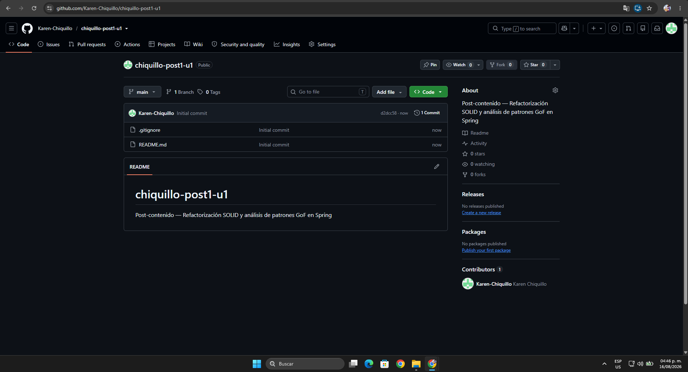

* **1.2 Clonación en terminal:** Ejecución del comando `git clone` en la terminal local del entorno de desarrollo.

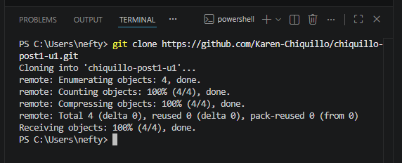

* **1.3 Verificación de directorio y git log:** Comprobación del workspace en VS Code y validación del commit inicial mediante `git log --oneline`.

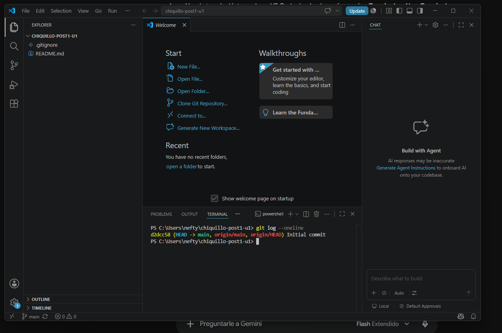

---

## 2. Checkpoint Paso 8: Demostración Funcional de Main.java

* **2.1 Ejecución en consola:** Compilación y ejecución exitosa del proyecto refactorizado mediante `mvn compile exec:java -Dexec.mainClass="com.patrones.u1.Main"`. Se comprueba el procesamiento de órdenes para clientes VIP y Regulares, la persistencia en repositorio, el envío de notificaciones y la impresión del reporte sin errores en tiempo de ejecución (`BUILD SUCCESS`).

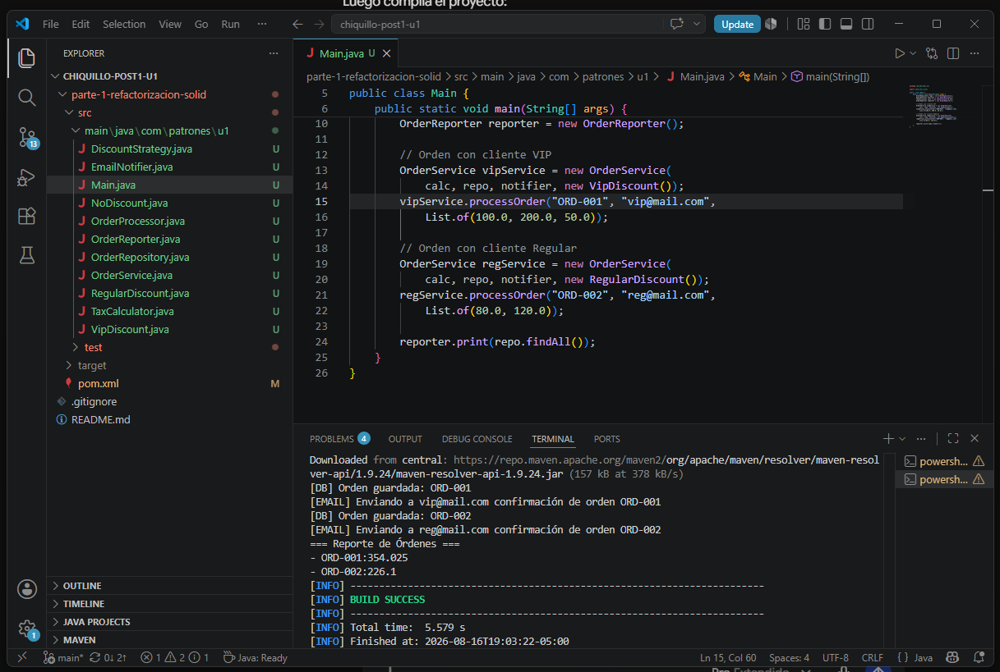

---

## 3. Checkpoint Paso 9: Historial de Commits SOLID y Sincronización Remota

* **3.1 Commits de refactorización SRP y OCP:** Separación de responsabilidades de `OrderProcessor` en clases cohesivas y desacoplamiento de algoritmos de descuento mediante la interfaz polimórfica `DiscountStrategy`.

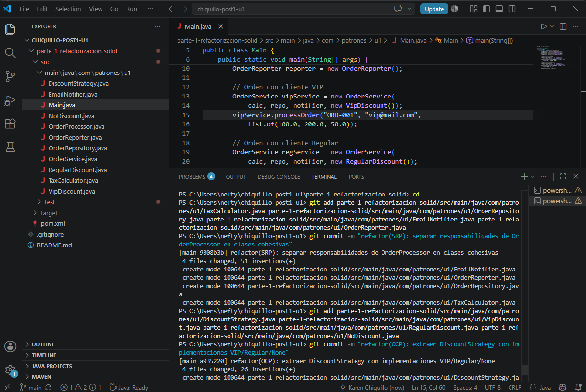

* **3.2 Commit de refactorización DIP y Push:** Inyección de dependencias por constructor en `OrderService`, clase de demostración `Main.java` y sincronización con la rama `main` remota mediante `git push`.

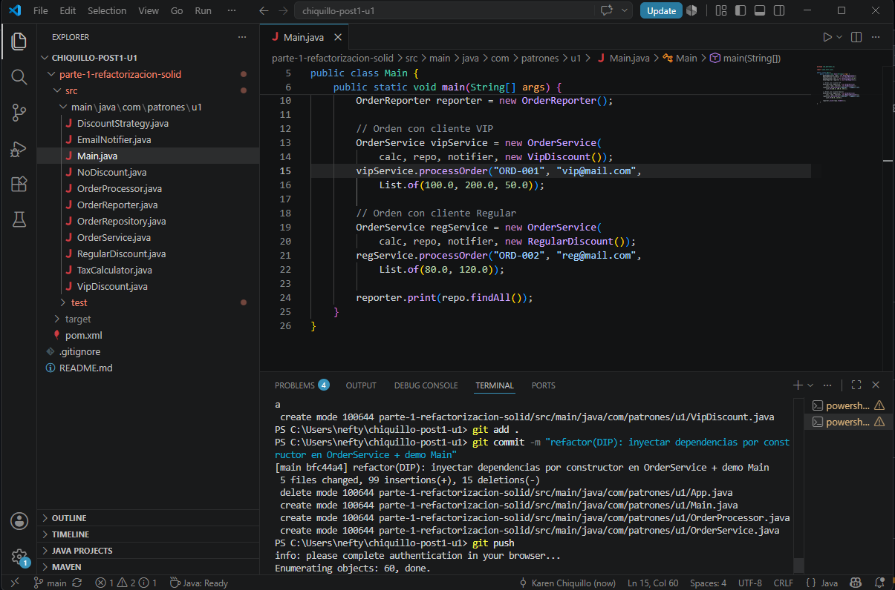

* **3.3 Historial de commits en GitHub:** Verificación del historial completo en la plataforma web de GitHub, evidenciando el flujo de trabajo incremental y los mensajes de commit descriptivos por cada principio aplicado.

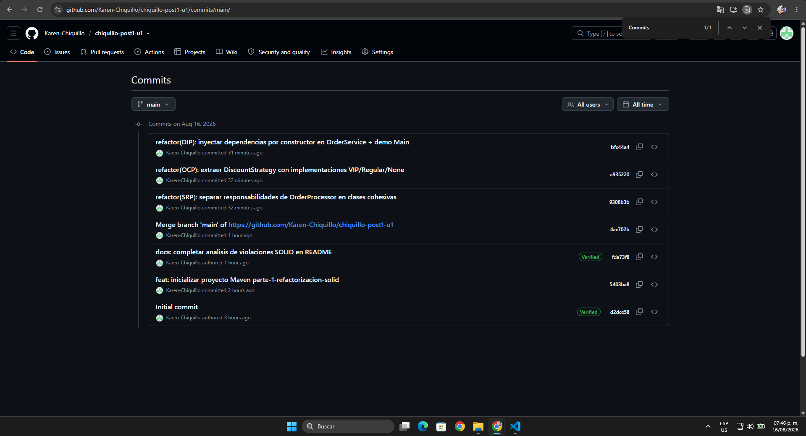

# Evidencias de Investigación — Parte 2: Análisis de Patrones GoF en Spring Framework

Este documento consolida las evidencias visuales y técnicas de la investigación realizada en el repositorio oficial de **Spring Framework** (`spring-projects/spring-framework`), en cumplimiento de los Pasos 10, 11, 12, 13 y 14 del post-contenido.

---

## 1. Checkpoint Paso 10: Estructura del Repositorio en VS Code

Captura del explorador de archivos en el entorno de desarrollo local que evidencia la coexistencia de ambas partes dentro del mismo proyecto.

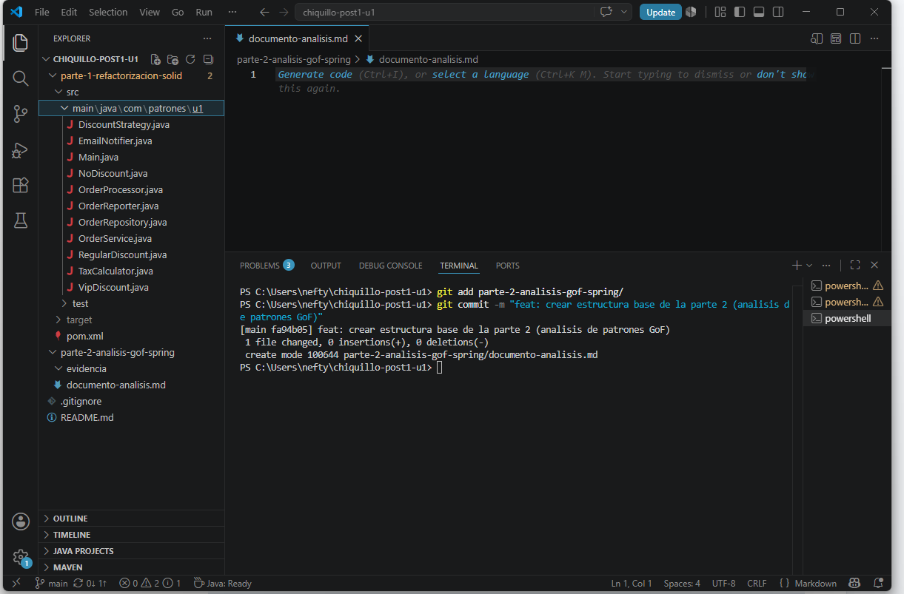

* **Validación de estructura:**
  * `parte-1-refactorizacion-solid/` (Proyecto Maven con código fuente refactorizado y clase `Main.java`).
  * `parte-2-analisis-gof-spring/` (Carpeta que aloja el archivo `documento-analisis.md` y la subcarpeta `evidencia/`).
  * `README.md` (En la raíz del repositorio).

---

## 2. Checkpoint Pasos 11 y 12 — Patrón 1: Factory Method (Creacional)

Investigación del contrato abstracto `BeanFactory` dentro del módulo `spring-beans`.

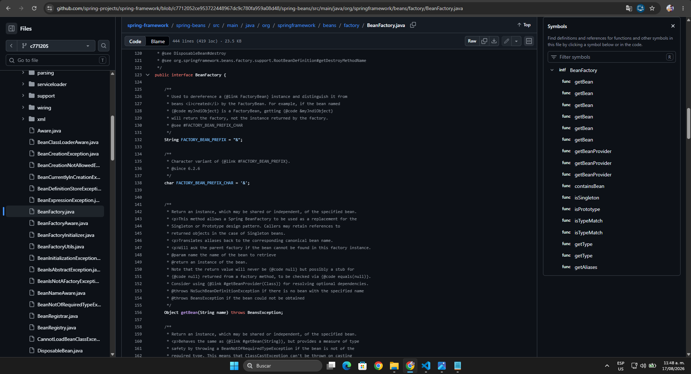

* **Ubicación técnica:** `org.springframework.beans.factory.BeanFactory` (`spring-beans`).
* **Rol GoF:** *Creator* abstracto.
* **Descripción de la evidencia:** Definición de la firma polimórfica `getBean(String name)` y su variante con genéricos `<T> T getBean(...)`, las cuales permiten resolver instancias administradas por el contenedor IoC sin acoplar al cliente a constructores concretos ni al operador `new`.
* **Principios SOLID asociados:** Dependency Inversion Principle (DIP) y Single Responsibility Principle (SRP).

---

## 3. Checkpoint Pasos 11 y 12 — Patrón 2: Facade (Estructural)

Investigación de la clase `JdbcTemplate` dentro del módulo `spring-jdbc`.

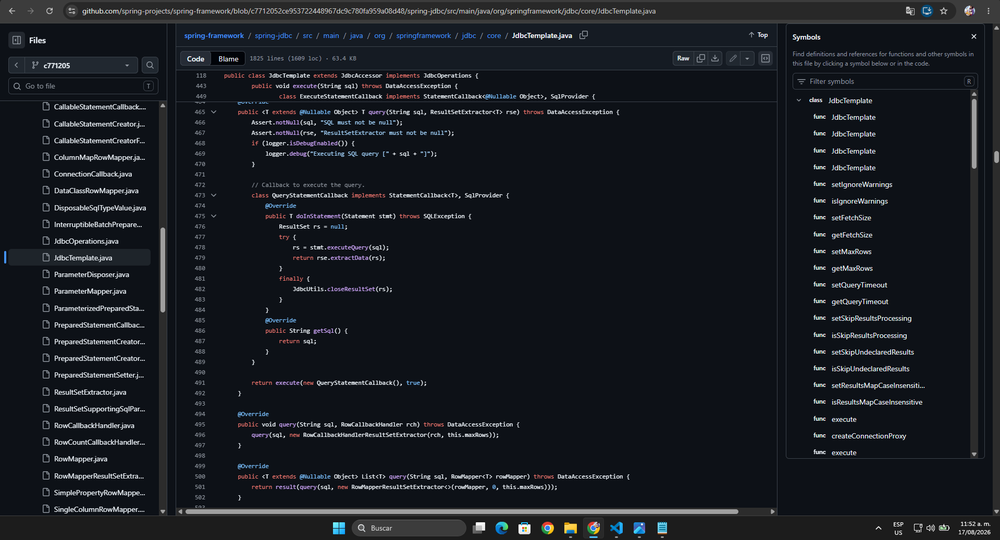

* **Ubicación técnica:** `org.springframework.jdbc.core.JdbcTemplate` (`spring-jdbc`).
* **Rol GoF:** *Facade* unificada sobre el subsistema nativo JDBC (`java.sql`).
* **Descripción de la evidencia:** Implementación de los métodos `execute(StatementCallback<T>, boolean)` y `query(...)`, evidenciando la absorción de tareas de bajo nivel: adquisición y liberación de conexiones (`Connection`), creación de sentencias (`Statement`), captura y traducción de `SQLException` a `DataAccessException`, y control de excepciones en bloques `finally`.
* **Principios SOLID asociados:** Single Responsibility Principle (SRP), Dependency Inversion Principle (DIP) y Open/Closed Principle (OCP).

---

## 4. Checkpoint Pasos 11 y 12 — Patrón 3: Observer (Comportamiento)

Investigación de la infraestructura de eventos desacoplada en el módulo `spring-context`.

* **4.1 Contrato del Observador (`ApplicationListener.java`):** Declaración de la interfaz funcional parametrizada `@FunctionalInterface public interface ApplicationListener<E extends ApplicationEvent>` y su método `onApplicationEvent(E event)`.

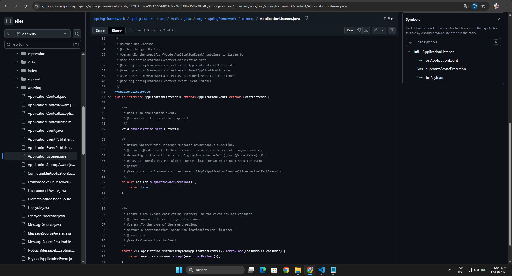

* **4.2 Despacho de Eventos (`SimpleApplicationEventMulticaster.java`):** Implementación del rol de Subject concreto con el método `multicastEvent(...)`, iterando sobre los observadores suscritos y despachando las notificaciones de manera síncrona o asíncrona mediante un `Executor`.

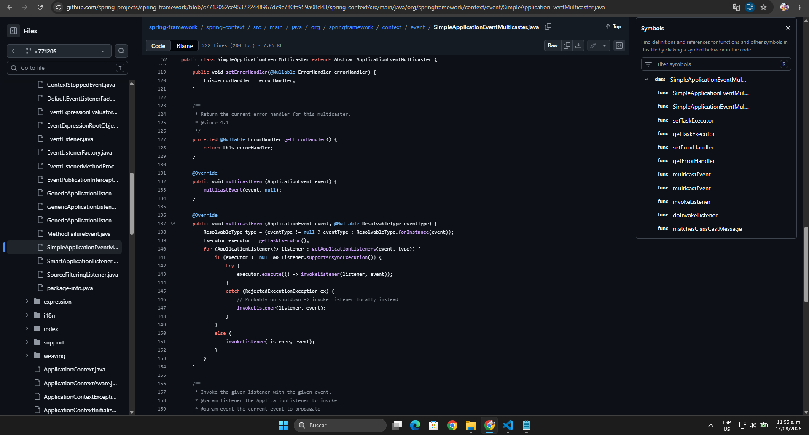

* **Ubicación técnica:** `org.springframework.context.ApplicationListener` y `org.springframework.context.event.SimpleApplicationEventMulticaster` (`spring-context`).
* **Principios SOLID asociados:** Open/Closed Principle (OCP), Single Responsibility Principle (SRP) y Dependency Inversion Principle (DIP).

---

